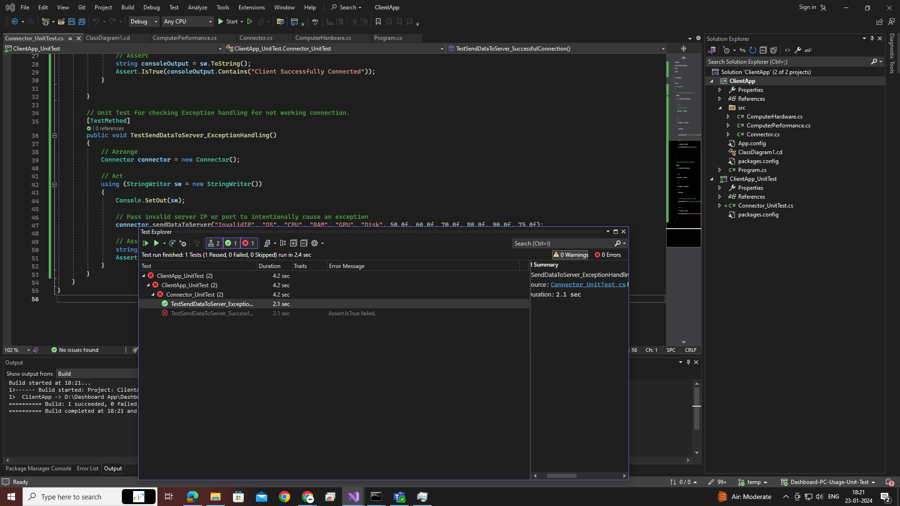
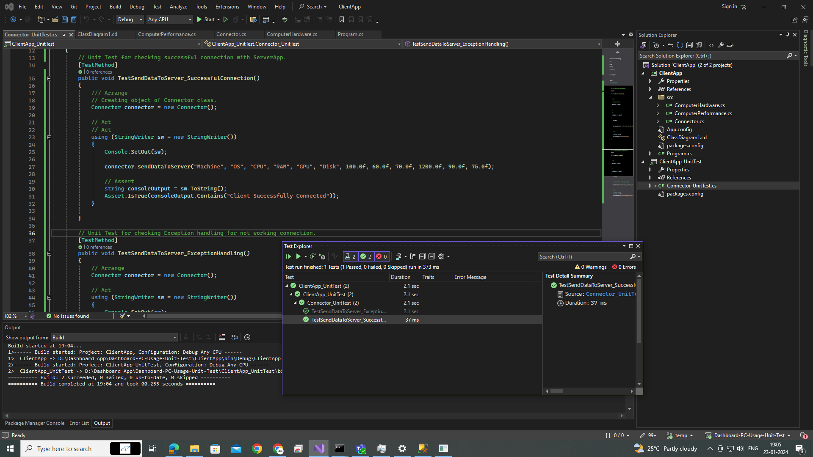
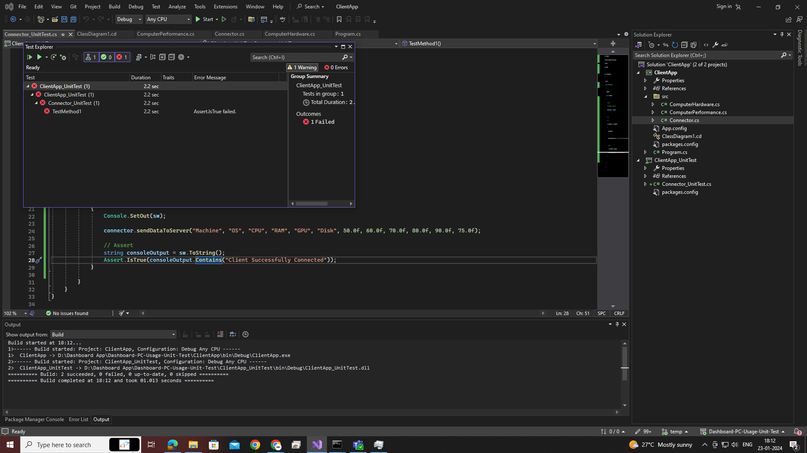
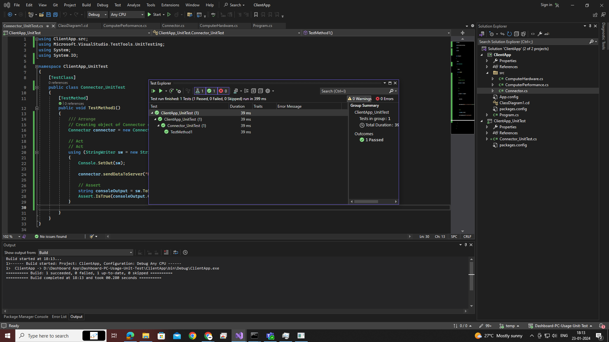

# ClientApp_UnitTest

Unit tests for the Client App component in the Dashboard PC Usage project using NUnit.

## Overview

This project contains unit tests to verify the functionalities of the Client App, including connecting to the server and collecting data.

## Running the Tests

Follow these steps to run the unit tests for the Client App:

1. Open the solution in Visual Studio.
2. Build the solution.
3. Use the NUnit Test Explorer in Visual Studio to discover and run the tests.
4. Verify that all tests pass.

## Additional Notes

- Mocking frameworks, such as Moq, can be used for simulating external dependencies in unit tests.

- Aim for high test coverage to ensure thorough testing of critical functionalities.

- Integrate unit tests into your continuous integration (CI) pipeline for automatic testing on each code commit.

## Contributing

Contributions to the unit tests are welcome! Fork the repository, add new tests or improve existing ones, and submit a pull request.

## License

This project's unit tests are under the same [CCtech](LICENSE) as the main project.

## Output

