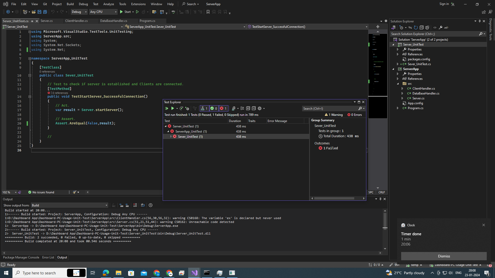
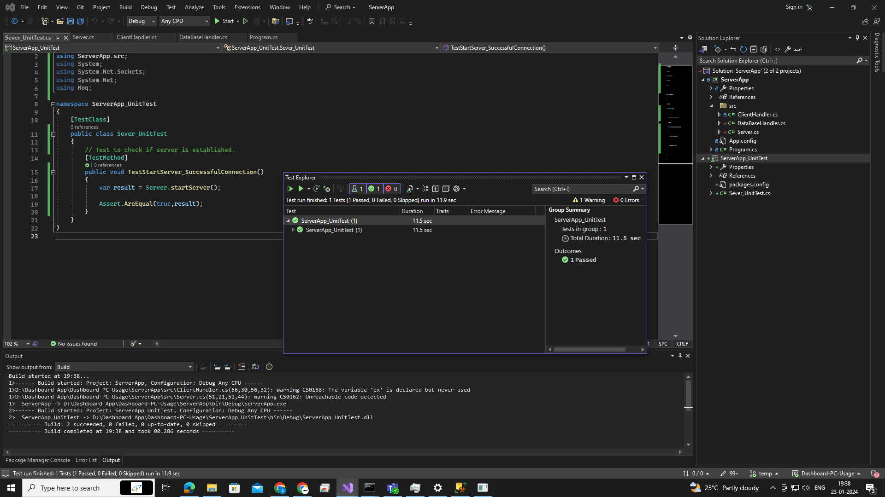
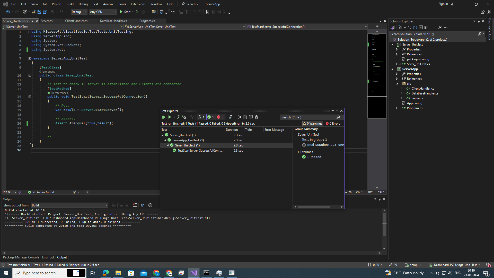
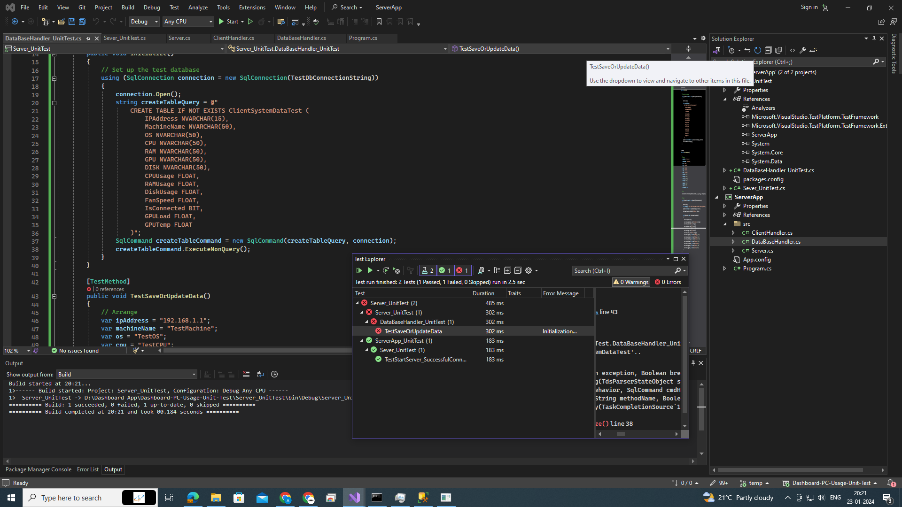

# Server App README

This server application is part of a Dashboard PC Usage system, designed to handle multiple client connections simultaneously and store received data in a SQL Server database using ADO.NET.

## Overview
The server app acts as a central hub, receiving real-time data from client applications running on individual PCs. It stores this data in a SQL Server database for later analysis and visualization.

## Table of Contents

1. [Introduction](#introduction)
2. [Getting Started](#getting-started)
    - [Prerequisites](#prerequisites)
    - [Installation](#installation)
3. [Usage](#usage)
    - [User Guide](#user-guide)
    - [Developer Guide](#developer-guide)
4. [Configuration](#configuration)
5. [Troubleshooting](#troubleshooting)
6. [Contributing](#contributing)
7. [License](#license)
8. [Output](#Output)

## Introduction

Our server app, developed in C# and utilizing socket programming, is a console application designed to facilitate data collection from systems connected to it in LAN. It enables users to save data from target PCs to SQL Sever. This app is particularly useful for System Admins,  etc.

## Getting Started

### Prerequisites

Before you begin, make sure you have the following installed:

- [.NET SDK](https://dotnet.microsoft.com/download) for C# development

### Installation

1. **Clone this repository to your local machine:**

    ```bash
    git clone https://github.com/Coderanildangi/Dashboard-PC-Usage.git
    ```

2. **Change into the project directory:**

    ```bash
    cd client-app
    ```

3. **Build the application:**

    ```bash
    dotnet build
    ```

4. **Run the application:**

    ```bash
    dotnet run
    ```

5. [Additional steps, such as configuring server connection parameters if applicable]

## Usage

### User Guide

#### Creating the Server

1. Launch the console application.
2. It automatically connects to remote client PCs.
3. It also collects data from client PCsand and information such as hardware information, performance parameters. 
4. Then it stores these data to SQL Sever for later visualization in Dashboard app.

#### Collecting Data

1. Once connected, collects data from PCs in LAN simultaneously.
2. Stores it in SQL server database.

### Developer Guide

#### Project Structure

The project follows a standard C# console application structure. Key components include:

- `Program.cs`: Main entry point of the application.
- `Server.cs`: Implementation TCPListener class for creating server.
- `ClientHandler.cs`: It collects Data from client PCs in real time.
- `DataBaseHandler.cs`: It connects server to SQL Server database.

#### Socket Programming

The application uses socket programming for communication. The `TCPListener` class handles the server side socket interactions. Developers interested in extending functionality should focus on this class.

## Configuration

The application requires manual putting of IP address of server.

## Troubleshooting

- Check you internet connection.
- The Client PC must be connected to LAN on which server runs.

## Contributing

We welcome contributions! If you find any issues or have ideas for improvements, please check out our [Contribution Guidelines](CONTRIBUTING.md).

## License

This project is licensed under the [CCtech].

## Output








